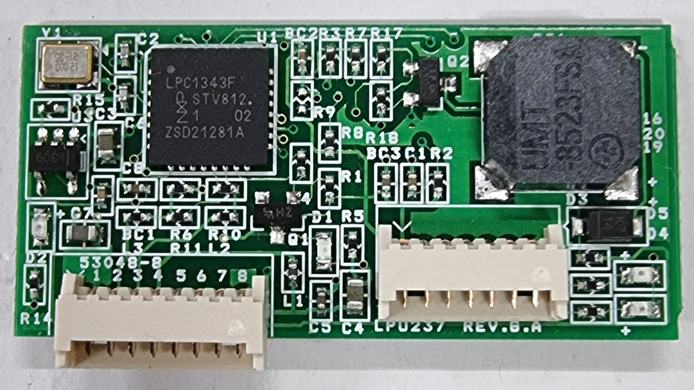

# LPU237 ROHS2 documents.
For editing this document, Use visual studo code + markdownlint extension.

The issue date is displayed in front of the file name. (xxxx.xx.xx) file name.

For getting all data, use clone of main branch.

## contents table
* [C type](#c-type)
* [D type](#d-type)
* E type - Discontinued
* [F type](#f-type)
* [M001 type](#m001-type)
* [M003 type](#m003-type)
* P001 type (=M003 type, this name is changed by customer.)
* [common parts](#common-parts)
   * [chip resistor and capactor](#chip-resistor-and-capactor)
   * [chip led](#chip-led)
   * [SS1F4](#SS1F4)
   * [UMT-8523FSA](#UMT-8523FSA)
   * [KTN2907](#KTN2907)
   * [MMBT2222](#MMBT2222)
   * [LPC1343](#LPC1343)
   * [SPX3819M5-L-3.3V](#SPX3819M5-L-3_3V)
   * [xtal 12MHz/3225 SMD 3225](#xtal-12MHz)
   * [53048-8](#53048-8)
   * [53048-4](#53048-4)
   * [Hansaem Digitech bare pcb](#Hansaem-bare-pcb)
   * [bead](#bead)
   * [DeltaAsic2100654X MLF15](#DeltaAsic2100654X-MLF15)
   * [yeonho connector](#connector-yeonho)
   * [43mm MSR housing](#43mm-MSR-housing)
   * [screw 3x6](#screw-3x6)
   * [screw 3x8](#screw-3x8)
   * [screw 2x2.5](#screw-2x2_5)
   * [magnetic head of C, D, E type](#magnetic-head-for-CDE)
   * [magnetic head for M, P type](#magnetic-head-for-MP)
   * [magnetic head cable](#magnetic-head-cable)
   * [guide for C, D, E type](#guide-for-CDE)
   * [guide for M, P type](#guide-for-MP)
   * [SS1F4](#SS1F4)
   * [74HC244](#74HC244)
   * [53047-2](#53047-2)
   * [53047-4](#53047-4)
   * [53047-5](#53047-5)
   * [53047-7](#53047-7)
   * [53047-8](#53047-8)
   * [74HC4066](#74HC4066)
   * [NZ9F3V6T5G](#NZ9F3V6T5G)

-------
## C type
- MSR function. USB interface. [UP](#contents-table)
- 
### board main
1. [chip resistor](#chip-resistor-and-capactor)
2. [chip capactor](#chip-resistor-and-capactor)
3. [chip led](#chip-led)
4. [SS1F4](#SS1F4)
5. [UMT-8523FSA](#UMT-8523FSA)
6. [KTN2907](#KTN2907)
7. [MMBT2222](#MMBT2222)
8. [LPC1343](#LPC1343)
9. [SPX3819M5-L-3.3V](#SPX3819M5-L-3_3V)
10. [xtal 12MHz/3225 SMD 3225](#xtal-12MHz)
11. [53048-8](#53048-8)
12. [53047-7](#53047-7)
13. [BARE PCB LPU230 REV.G.A , 1.0T](#Hansaem-bare-pcb)
14. [bead](#bead)

### board head
1. [chip resistor](#chip-resistor-and-capactor)
2. [chip capactor](#chip-resistor-and-capactor)
3. [MMD1100 MLF15](#MMD1100)
4. [12505WR-07](#connector-yeonho)
5. [BARE PCB HEAD CSS TMSR REV.C.B , 0.6T](#Hansaem-bare-pcb)

### mechanism
1. [43mm MSR housing](#43mm-MSR-housing)
2. [guide](#guide-for-CDE)
3. [screw of guide](#screw-3x6)
4. [screw of complete](#screw-3x8)
5. [screw of head](#screw-2x2_5)

### assembly
1. [magnetic head](#magnetic-head-for-CDE)
2. [magnetic head cable](#magnetic-head-cable)

-------
## D type
- MSR, i-button functions. USB, RS232 interface.[UP](#contents-table)
- 
### board main
1. [chip resistor](#chip-resistor-and-capactor)
2. [chip capactor](#chip-resistor-and-capactor)
3. [chip led](#chip-led)
4. [SS1F4](#SS1F4)
5. [UMT-8523FSA](#UMT-8523FSA)
6. [KTN2907](#KTN2907)
7. [MMBT2222](#MMBT2222)
8. [74HC244](#74HC244)
9. [LPC1343](#LPC1343)
10. [SPX3819M5-L-3.3V](#SPX3819M5-L-3_3V)
11. [xtal 12MHz/3225 SMD 3225](#xtal-12MHz)
12. [53047-2](#53047-2)
13. [53047-4](#53047-4)
14. [53047-8](#53047-8)
15. [74HC4066](#74HC4066)
16. [bead](#bead)
17. [BARE PCB LPU230-1 REV.F.A , 1.6T](#Hansaem-bare-pcb)
18. [NZ9F3V6T5G](#NZ9F3V6T5G)

### board head
1. [chip resistor](#chip-resistor-and-capactor)
2. [chip capactor](#chip-resistor-and-capactor)
3. [DeltaAsic2100654X MLF15](#DeltaAsic2100654X-MLF15)
4. [12505WR-04](#connector-yeonho)
5. [BARE PCB HEAD LPU230-1 REV.C.E , 0.6T](#Hansaem-bare-pcb)

### mechanism
1. [43mm MSR housing](#43mm-MSR-housing)
2. [guide](#guide-for-CDE)
3. [screw of guide](#screw-3x6)
4. [screw of complete](#screw-3x8)
5. [screw of head](#screw-2x2_5)

### assembly
1. [magnetic head](#magnetic-head-for-CDE)
2. [magnetic head cable](#magnetic-head-cable)

-------
## F type
- i-button function only.[UP](#contents-table)
### F00N - USB and RS232 interfaces.
- 
1. [chip resistor](#chip-resistor-and-capactor)
2. [chip capactor](#chip-resistor-and-capactor)
3. [chip led](#chip-led)
4. [UMT-8523FSA](#UMT-8523FSA)
5. [KTN2907](#KTN2907)
6. [MMBT2222](#MMBT2222)
7. [LPC1343](#LPC1343)
8. [SPX3819M5-L-3.3V](#SPX3819M5-L-3_3V)
9. [xtal 12MHz/3225 SMD 3225](#xtal-12MHz)
10. [bead](#bead)
11. [12505WS-08](#connector-yeonho)
12. [12505WS-02](#connector-yeonho)
13. MAX3232CPW [rohs](./circuit/MAX3232/szzq088r.pdf) - (2024.05.23)
14. [SS1F4](#SS1F4)
15. [BARE PCB LPU230-2 REV.D.A , 1.6T](#Hansaem-bare-pcb)

### F00NU - USB only interface.
- 
1. [chip resistor](#chip-resistor-and-capactor)
2. [chip capactor](#chip-resistor-and-capactor)
3. [chip led](#chip-led)
4. [UMT-8523FSA](#UMT-8523FSA)
5. [KTN2907](#KTN2907)
6. [MMBT2222](#MMBT2222)
7. [LPC1343](#LPC1343)
8. [SPX3819M5-L-3.3V](#SPX3819M5-L-3_3V)
9. [xtal 12MHz/3225 SMD 3225](#xtal-12MHz)
10. [bead](#bead)
11. ~~DF13-5P-1.25DS [rohs](./circuit/hirose/) - waiting a e-mail.~~
12. [12505WS-02](#connector-yeonho)
13. [SS1F4](#SS1F4)
14. [BARE PCB LPU230-3 REV.A.A , 1.6T](#Hansaem-bare-pcb) - The printed in PCB as "LPU230-2 REV.E.A".
the revision string(LPU230-2 REV.E.A) of printed in PCB is the mis revision string. In developing, LPU230-2 REV.E.A of F00N  was changed to  the  LPU230-3 REV.A.A of F00NU by customer request.

## M001 type
- very compact type.[UP](#contents-table)
1. [declaration of Rohs conformity](./product/m/DoC_엘퍼스크(LPU237-M001).pdf) - This product is tested at ETL test laboratory.
   * (2019.08.01) DoC_엘퍼스크(LPU237-M001).pdf

## M003 type
- POGO pin type  [UP](#contents-table)
- 
### board main
1. [chip resistor](#chip-resistor-and-capactor)
2. [chip capactor](#chip-resistor-and-capactor)
3. [chip led](#chip-led)
4. [bead](#bead)
5. ~~UMT-8235 5V~~
6. ~~1N4148~~
7. [KTN2907](#KTN2907)
8. [MMBT2222](#MMBT2222)
9. [LPC1343](#LPC1343)
10. [DeltaAsic2100654X MLF15](#DeltaAsic2100654X-MLF15)
11. [SPX3819M5-L-3.3V](#SPX3819M5-L-3_3V)
12. [74HC244](#74HC244)
13. [xtal 12MHz/3225 SMD 3225](#xtal-12MHz)
14. ~~532610571~~
15. [10019HR-04A00](#connector-yeonho)
16. [BARE PCB LPU237-5G](#Hansaem-bare-pcb)

### mechanism
1. [guide](#guide-for-MP)
2. [screw of head](#screw-2x2_5)

### assembly
1. [magnetic head](#magnetic-head-for-MP)

-------
-------
[UP](#contents-table)
## common parts
### chip resistor and capactor
   * [resistor](./circuit/rc/20250205_WTC_RoHS2_0_Halogen_Free_REACH_Compliance_Declaration.pdf)
     * (2025.02.27) 20250205_WTC_RoHS2_0_Halogen_Free_REACH_Compliance_Declaration.pdf
   * [capacitor](./circuit/rc/20250205_WTC_RoHS2_0_Halogen_Free_REACH_Compliance_Declaration.pdf)
     * (2025.02.27) 20250205_WTC_RoHS2_0_Halogen_Free_REACH_Compliance_Declaration.pdf
### chip led
[rohs](./circuit/led/2020-SGS-chip-ROHS-RUNLED.pdf), [reach](./circuit/led/2020-SGS-REACH-CHIP-RUNLED.pdf)
   * (2020.08.07) 2020-SGS-chip-ROHS-RUNLED.pdf
   * (2020.08.12) 2020-SGS-REACH-CHIP-RUNLED.pdf
### SS1F4
[rohs](./circuit/ss1f4/rohs_compliancestatement_01012023.pdf)
   * (2023.01.01) rohs_compliancestatement_01012023.pdf
### UMT-8523FSA
[rohs](./circuit/buzzer/201104_UMT_8523FSA_ROHS_REPORT_자이온전자.xls)
   * (2019.10.10) 201104_UMT_8523FSA_ROHS_REPORT_자이온전자.xls
### KTN2907  
[rohs](./circuit/tr/RoHS2.0_KEC.pdf)
   * ~~(기한없음) RoHS2.0_KEC.pdf~~
### MMBT2222
[rohs](./circuit/tr/mmbt2222.zip)
   * (2019.08.27) KWUNSHAN_SGS_EN.PDF
   * (2019.11.26) MMBT2222ALT1G_MSDS.xls
   * (2019.05.15) RoHS-A42+Cu1(due date 2020-5-15).pdf
   * (2019.06.13) TANAKA 17.SGS_Pd Coating Cu Wire.pdf
   * (2019.03.21) 2.GE-200 Series - RoHSI.pdf
   * (2019.05.07) GE-200 Series - Halogen, Sb.pdf
   * (2019.05.09) GE-200 Series - Phthalates.pdf
   * (2019.05.07) GE-200 Series - RoHS II.pdf
   * (2019.03.14) on-semi Be Sb SCG_HONG_KONG-TestReport2019-02-21-028-8139.pdf
   * (2019.03.14) on-semi SCG_HONG_KONG-TestReport2019-02-21-028-8135.pdf
   * (2019.03.14) on-semi SCG_HONG_KONG-TestReport2019-02-21-028-8137.pdf
### LPC1343
[rohs](./circuit/mcu/NXP-ROHS-DECLARATION.pdf)
   * (2022.02.28) NXP-ROHS-DECLARATION.pdf
### SPX3819M5-L-3_3V
[rohs](./circuit/spx3819/DownloadQuality.pdf)
   * (2025.05.21) DownloadQuality.pdf
### xtal 12MHz
[rohs](./circuit/xtal/TSN20-010138-02_EC_TP20-003958_F--SMD_Crystal.PDF)
   * (2020.06.23) TSN20-010138-02_EC_TP20-003958_F--SMD_Crystal.PDF
### 53048-8
[rohs](./circuit/connector/molex/molex_connector.pdf)
   * (2025.05.21) molex_connector.pdf
### 53048-4
[rohs](./circuit/connector/molex/molex_connector.pdf)
   * (2025.05.21) molex_connector.pdf
### Hansaem bare pcb
[rohs](./circuit/pcb/hsdgt/Han_Saem_Digtec_2025_RoHS.pdf)
   * (2025.01.17) Han_Saem_Digtec_2025_RoHS.PDF
### bead
[rohs](./circuit/bead/완제품_CHIP_BEAE_RoHS,Sb,Be,HF,Ph_20200317.pdf)
   * (2020.03.17) 완제품_CHIP_BEAE_RoHS,Sb,Be,HF,Ph_20200317.pdf   
### DeltaAsic2100654X MLF15 - Discontinued

### MMD1100 - None

### connector yeonho
[rohs](./circuit/connector/yeonho/yeonho.zip)
   * (2019.01.22) C2680 MSDS.pdf
   * (2019.01.22) C5210 MSDS.pdf
   * (2020.06.23) PA6T E430N-T5 NC ICP.pdf
   * (2020.06.26) A504X90 Br,Cl_20200626.pdf
   * (2020.06.26) A504X90 RoHS6,Ph8,MCCP,HBCDD20200626.pdf
   * (2020.06.26) A504X90 Sb_20200626.pdf
### 43mm MSR housing
[rohs](./mechanism/43mm_하우징(기구).zip)
   * (2020.05.27) 304检测ROHS英文.PDF
   * (2020.01.03) 2020年ROHS十项检测报告（C5191中文）.PDF
   * (2019.05.07) ABS750A+ROHS2.0+中文报告.PDF
   * (2020.04.01) QLAB-203TO15 C 20200401 新辉模具 ROHS6项 加盖CNAS.pdf
### screw 3x6
[rohs](./screw/GUIDE_스크류(3X6).zip)
   * (2020.1.17) RoHS 3가착 20200117.pdf
### screw 3x8
[rohs](./screw/완조립_스크류(3X8).zip)
   * (2020.1.17) RoHS 3가착 20200117.pdf
### screw 2x2_5
[rohs](./screw/헤드_스크류(2X2.5).zip)
   * (2020.03.19) screw（BOCQRC1）.pdf
   * (2019.08.01) 헤드 및 스크류(2 X 2.5).pdf
### magnetic head for CDE
[rohs](./assembly/C_D_E_타입용_HEAD(기구).zip)
   * (2020.09.17) 1J85 (1J85C、1J85X、1J79、1J79D、BYR79C、BYR6)英文.PDF
   * (2019.04.17) 5aSGS中文.PDF
   * (2020.07.23) 301-ROHS10项-20200723.PDF
   * (2020.03.25) 2020gapspacer.pdf
   * (2020.03.14) A2200045972101001.pdf
   * (2020.03.24) QLAB-203TO12 C 新辉模具 ROHS10+ROHS4项 加盖CNAS.pdf
   * (2019.04.22) UEW-F UEW-GF.PDF
   * (2019.04.04) 原料太钢301S-ROHS10-20190304E.pdf
### magnetic head for MP
[rohs](./assembly/M_P_type_header.zip)
   * (2020.09.17) 1J85 (1J85C、1J85X、1J79、1J79D、BYR79C、BYR6)英文.PDF
   * (2019.04.17) 5aSGS中文.PDF
   * (2020.07.23) 301-ROHS10项-20200723.PDF
   * (2020.03.14) A2200045972101001.pdf
   * (2019.01.22) QLAB-191TO03  RoHS 6 项 中文_HEAD.pdf
   * (2020.03.24) QLAB-203TO12 C 新辉模具 ROHS10+ROHS4项 加盖CNAS.pdf
   * (2019.04.22) UEW-F UEW-GF.PDF
### magnetic head cable
[rohs](./assembly/HEAD_CABLE.zip)
   * (2020.12.09) Molex(510210400).pdf
   * (2020.03.05) 2020年rohs10项白红黑.pdf
   * (2020.03.16) 裸铜线（英文）.pdf
   * (2025.05.21) molex_connector.pdf
### guide for CDE
[rohs](./mechanism/HF380.RoHS+Phthalates.200313_TCOA20-0077-01.pdf)
   * (2020.3.13) HF380.RoHS+Phthalates.200313_TCOA20-0077-01.pdf 
### guide for MP
[rohs](./mechanism/ABS750A+ROHS2.0.PDF)
   * (2019.05.07) ABS750A+ROHS2.0.PDF     
### SS1F4
[rohs](./circuit/diode/rohs_compliancestatement_01012023.pdf)
   * (2023.01.01) rohs_compliancestatement_01012023.pdf
### 74HC244
[rohs](./circuit/74HC244/NXP-ROHS-DECLARATION.pdf)
   * (2022.02.28) NXP-ROHS-DECLARATION.pdf
### 53047-2
[rohs](./circuit/connector/molex/molex_connector.pdf)
   * (2025.05.21) molex_connector.pdf
### 53047-4
[rohs](./circuit/connector/molex/molex_connector.pdf)
   * (2025.05.21) molex_connector.pdf
### 53047-5
[rohs](./circuit/connector/molex/molex_connector.pdf)
   * (2025.05.21) molex_connector.pdf
### 53047-7
[rohs](./circuit/connector/molex/molex_connector.pdf)
   * (2025.05.21) molex_connector.pdf
### 53047-8
[rohs](./circuit/connector/molex/molex_connector.pdf)
   * (2025.05.21) molex_connector.pdf
### 74HC4066
[rohs](./circuit/74HC4066D/NXP-ROHS-DECLARATION.pdf)
   * (2022.02.28) NXP-ROHS-DECLARATION.pdf
### NZ9F3V6T5G
[rohs](./circuit/NZ9F3V6T5G/MaterialComposition.pdf)
   * (2020.12.10) MaterialComposition.pdf

