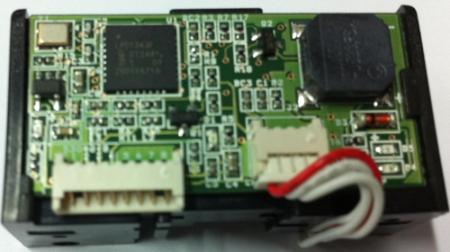

# LPU237 ROHS2 documents.
For editing this document, Use visual studo code + markdownlint extension.

The issue date is displayed in front of the file name. (xxxx.xx.xx) file name.

For getting all data, use clone of main branch.

## contents table
* [C type](#c-type)
* [D type](#d-type)
* [E type](#e-type)
* [F type](#f-type)
* [M001 type](#m001-type)
* [M003 type](#m003-type)
* [P001 type](#p001-type)
* [common parts](#common-parts)
   * [chip resistor and capactor](#chip-resistor-and-capactor)
   * [chip led](#chip-led)
   * [SSF14](#SSF14)
   * [UMT-8523FSA](#UMT-8523FSA)
   * [KTN2907](#KTN2907)
   * [MMBT2222](#MMBT2222)
   * [LPC1343](#LPC1343)
   * [SPX3819M5-L-3.3V](#SPX3819M5-L-3_3V)
   * [xtal 12MHz/3225 SMD 3225](#xtal-12MHz)
   * [53048-8](#53048-8)
   * [53048-4](#53048-4)
   * [Hansaem Digitech bare pcb](#Hansaem-bare-pcb)
   * [bead](#bead)
   * [DeltaAsic2100654X MLF15](#DeltaAsic2100654X-MLF15)
   * [yeonho connector](#connector-yeonho)
   * [43mm MSR housing](#43mm-MSR-housing)
   * [screw 3x6](#screw-3x6)
   * [screw 3x8](#screw-3x8)
   * [screw 2x2.5](#screw-2x2_5)
   * [magnetic head of C, D, E type](#magnetic-head-for-CDE)
   * [magnetic head for M, P type](#magnetic-head-for-MP)
   * [magnetic head cable](#magnetic-head-cable)
   * [guide for C, D, E type](#guide-for-CDE)
   * [guide for M, P type](#guide-for-MP)
   * [SS14](#SS14)
   * [74HC244](#74HC244)
   * [53047-2](#53047-2)
   * [53047-4](#53047-4)
   * [53047-5](#53047-5)
   * [53047-8](#53047-8)
   * [74HC4066](#74HC4066)
   * [NZ9F3V6T5G](#NZ9F3V6T5G)

-------
## C type
- MSR function. USB interface. [UP](#contents-table)
- 
### board main
1. [chip resistor](#chip-resistor-and-capactor)
2. [chip capactor](#chip-resistor-and-capactor)
3. [chip led](#chip-led)
4. [SSF14](#SSF14)
5. [UMT-8523FSA](#UMT-8523FSA)
6. [KTN2907](#KTN2907)
7. [MMBT2222](#MMBT2222)
8. [LPC1343](#LPC1343)
9. [SPX3819M5-L-3.3V](#SPX3819M5-L-3_3V)
10. [xtal 12MHz/3225 SMD 3225](#xtal-12MHz)
11. [53048-8](#53048-8)
12. [53048-4](#53048-4)
13. [BARE PCB LPU230 REV.E.A , 1.0T](#Hansaem-bare-pcb)
14. [bead](#bead)

### board head
1. [chip resistor](#chip-resistor-and-capactor)
2. [chip capactor](#chip-resistor-and-capactor)
3. [DeltaAsic2100654X MLF15](#DeltaAsic2100654X-MLF15)
4. [12505WR-04](#connector-yeonho)
5. [BARE PCB HEAD LPU230-1 REV.C.E , 0.6T](#Hansaem-bare-pcb)

### mechanism
1. [43mm MSR housing](#43mm-MSR-housing)
2. [guide](#guide-for-CDE)
3. [screw of guide](#screw-3x6)
4. [screw of complete](#screw-3x8)
5. [screw of head](#screw-2x2_5)

### assembly
1. [magnetic head](#magnetic-head-for-CDE)
2. [magnetic head cable](#magnetic-head-cable)

-------
## D type
- MSR, i-button functions. USB, RS232 interface.[UP](#contents-table)
- 
### board main
1. [chip resistor](#chip-resistor-and-capactor)
2. [chip capactor](#chip-resistor-and-capactor)
3. [chip led](#chip-led)
4. [SSF14](#SSF14)
5. [SS14](#SS14)
6. [UMT-8523FSA](#UMT-8523FSA)
7. [KTN2907](#KTN2907)
8. [MMBT2222](#MMBT2222)
9. [74HC244](#74HC244)
10. [LPC1343](#LPC1343)
11. [SPX3819M5-L-3.3V](#SPX3819M5-L-3_3V)
12. [xtal 12MHz/3225 SMD 3225](#xtal-12MHz)
13. [53047-2](#53047-2)
14. [53047-4](#53047-4)
15. [53047-8](#53047-8)
16. [74HC4066](#74HC4066)
17. [bead](#bead)
18. [BARE PCB LPU230-1 REV.F.A , 1.6T](#Hansaem-bare-pcb)
19. [NZ9F3V6T5G](#NZ9F3V6T5G)

### board head
1. [chip resistor](#chip-resistor-and-capactor)
2. [chip capactor](#chip-resistor-and-capactor)
3. [DeltaAsic2100654X MLF15](#DeltaAsic2100654X-MLF15)
4. [12505WR-04](#connector-yeonho)
5. [BARE PCB HEAD LPU230-1 REV.C.E , 0.6T](#Hansaem-bare-pcb)

### mechanism
1. [43mm MSR housing](#43mm-MSR-housing)
2. [guide](#guide-for-CDE)
3. [screw of guide](#screw-3x6)
4. [screw of complete](#screw-3x8)
5. [screw of head](#screw-2x2_5)

### assembly
1. [magnetic head](#magnetic-head-for-CDE)
2. [magnetic head cable](#magnetic-head-cable)

-------
## E type
- MSR, i-button functions. USB, RS232 interface. USB hub(For SCR).[UP](#contents-table)
- 
### board main
1. [chip resistor](#chip-resistor-and-capactor)
2. [chip capactor](#chip-resistor-and-capactor)
3. [chip led](#chip-led)
4. [SSF14](#SSF14)
5. [SS14](#SS14)
6. [UMT-8523FSA](#UMT-8523FSA)
7. [KTN2907](#KTN2907)
8. [MMBT2222](#MMBT2222)
9. SI2303DS [rohs](./circuit/tr/SI2303CDS-T1-GE3.zip)
   * (2020.08.18) CE_2020_81335A  C194(SDI)_Lead frame 20200818.pdf
   * (2019.12.24) CEL-1702HF SERIES _Mold compound_RoHS Halogen 20191224.pdf
   * (2020.08.18) EN-4620K_SHA20-149211-03_Die attach_F 20200818.PDF
   * (2020.10.08) TANAKA - RoHS - ICP Test Report for TPCW (Cu Wire)  (2020-10-08).pdf
   * (2020.09.23) Test Report_SGS_CE_2020_92366_Silicon wafer 20200923.pdf
   * (2020.02.24) Tin plating_SINYANG 20200224.pdf
10. [74HC244](#74HC244)
11. AU9254A21 [rohs](./circuit/AU9254A21/RoHS3+REACH(209_SVHC)_CoC-Alcorlink.pdf)
    * (2020.06.25) RoHS3+REACH(209_SVHC)_CoC-Alcorlink.pdf
12. [LPC1343](#LPC1343)
13. [SPX3819M5-L-3.3V](#SPX3819M5-L-3_3V)
14. [xtal 12MHz/3225 SMD 3225](#xtal-12MHz)
15. [53047-2](#53047-2)
16. [53047-4](#53047-4)
17. [53047-5](#53047-5)
18. [53047-8](#53047-8)
19. [BARE PCB LPU230-1 REV.F.A , 1.6T](#Hansaem-bare-pcb)
20. [74HC4066](#74HC4066)
21. [NZ9F3V6T5G](#NZ9F3V6T5G)

### board head
1. [chip resistor](#chip-resistor-and-capactor)
2. [chip capactor](#chip-resistor-and-capactor)
3. [DeltaAsic2100654X MLF15](#DeltaAsic2100654X-MLF15)
4. [12505WR-04](#connector-yeonho)
5. [BARE PCB HEAD LPU230-1 REV.C.E , 0.6T](#Hansaem-bare-pcb)

### mechanism
1. [43mm MSR housing](#43mm-MSR-housing)
2. [guide](#guide-for-CDE)
3. [screw of guide](#screw-3x6)
4. [screw of complete](#screw-3x8)
5. [screw of head](#screw-2x2_5)

### assembly
1. [magnetic head](#magnetic-head-for-CDE)
2. [magnetic head cable](#magnetic-head-cable)

-------
## F type
- i-button function only.[UP](#contents-table)
### F00N - USB and RS232 interfaces.
- 
1. [chip resistor](#chip-resistor-and-capactor)
2. [chip capactor](#chip-resistor-and-capactor)
3. [chip led](#chip-led)
4. [UMT-8523FSA](#UMT-8523FSA)
5. [KTN2907](#KTN2907)
6. [MMBT2222](#MMBT2222)
7. [LPC1343](#LPC1343)
8. [SPX3819M5-L-3.3V](#SPX3819M5-L-3_3V)
9. [xtal 12MHz/3225 SMD 3225](#xtal-12MHz)
10. [bead](#bead)
11. [12505WS-08](#connector-yeonho)
12. [12505WS-02](#connector-yeonho)
13. MAX3232CPW [rohs](./circuit/MAX3232/MAX3232CPW.pdf)
14. [SSF14](#SSF14)
15. [BARE PCB LPU230-2 REV.D.A , 1.6T](#Hansaem-bare-pcb)

### F00NU - USB only interface.
- 
1. [chip resistor](#chip-resistor-and-capactor)
2. [chip capactor](#chip-resistor-and-capactor)
3. [chip led](#chip-led)
4. [UMT-8523FSA](#UMT-8523FSA)
5. [KTN2907](#KTN2907)
6. [MMBT2222](#MMBT2222)
7. [LPC1343](#LPC1343)
8. [SPX3819M5-L-3.3V](#SPX3819M5-L-3_3V)
9. [xtal 12MHz/3225 SMD 3225](#xtal-12MHz)
10. [bead](#bead)
11. ~~DF13-5P-1.25DS [rohs](./circuit/hirose/) - waiting a e-mail.~~
12. [12505WS-02](#connector-yeonho)
13. [SSF14](#SSF14)
14. [BARE PCB LPU230-3 REV.A.A , 1.6T](#Hansaem-bare-pcb) - The printed in PCB as "LPU230-2 REV.E.A".
the revision string(LPU230-2 REV.E.A) of printed in PCB is the mis revision string. In developing, LPU230-2 REV.E.A of F00N  was changed to  the  LPU230-3 REV.A.A of F00NU by customer request.

## M001 type
- very compact type.[UP](#contents-table)
1. [declaration of Rohs conformity](./product/m/DoC_엘퍼스크(LPU237-M001).pdf) - This product is tested at ETL test laboratory.
   * (2019.08.01) DoC_엘퍼스크(LPU237-M001).pdf

## P001 type
- very compact type and -_-;; .[UP](#contents-table)
### board main
1. [chip resistor](#chip-resistor-and-capactor)
2. [chip capactor](#chip-resistor-and-capactor)
3. [chip led](#chip-led)
4. [bead](#bead)
5. [KTN2907](#KTN2907)
6. [LPC1343](#LPC1343)
7. [DeltaAsic2100654X MLF15](#DeltaAsic2100654X-MLF15)
8. [SPX3819M5-L-3.3V](#SPX3819M5-L-3_3V)
9. [xtal 12MHz/3225 SMD 3225](#xtal-12MHz)
10. ~~50439-005~~
11. [BARE PCB LPU237-P001, 0.4T](#Hansaem-bare-pcb)

### mechanism
1. [guide](#guide-for-MP)
2. [screw of head](#screw-2x2_5)

### assembly
1. [magnetic head](#magnetic-head-for-MP)

## M003 type
-  [UP](#contents-table)
### board main
1. [chip resistor](#chip-resistor-and-capactor)
2. [chip capactor](#chip-resistor-and-capactor)
3. [chip led](#chip-led)
4. [bead](#bead)
5. ~~UMT-8235 5V~~
6. ~~1N4148~~
7. [KTN2907](#KTN2907)
8. [MMBT2222](#MMBT2222)
9. [LPC1343](#LPC1343)
10. [DeltaAsic2100654X MLF15](#DeltaAsic2100654X-MLF15)
11. [SPX3819M5-L-3.3V](#SPX3819M5-L-3_3V)
12. [74HC244](#74HC244)
13. [xtal 12MHz/3225 SMD 3225](#xtal-12MHz)
14. ~~532610571~~
15. [10019HR-04A00](#connector-yeonho)
16. [BARE PCB LPU237-5G](#Hansaem-bare-pcb)

### mechanism
1. [guide](#guide-for-MP)
2. [screw of head](#screw-2x2_5)

### assembly
1. [magnetic head](#magnetic-head-for-MP)

-------
-------
[UP](#contents-table)
## common parts
### chip resistor and capactor
   * [rohs](./circuit/rc/ROHS.egg)
     * (2019.12.20) (CE_2019_C2262) (Jumper)-20191220.pdf
     * (2020.04.28) (CE_2020_44224) Y5V-20200428.pdf
     * (2020.04.28) (CE_2020_44225) X5R-20200428.pdf
     * (2020.04.28) (CE_2020_44226) X7R_X6S_X7S-20200428.pdf
     * (2020.04.28) (CE_2020_44227) NPO-20200428.pdf
     * (2020.08.24) (CE_2020_82443) (Array)(WAxx_WT04)-20200824.pdf
     * (2020.08.24) (CE_2020_82444) (Chip-R)(WRxxX_W.WFxxH_G_K_P_S.WWxxX)-20200824.pdf
   * [msds](./circuit/rc/MSDS.7z)
     * (2019.12.19) 20191219-MLCC-SDS(NP0_HH_MT_MG).pdf
     * (2019.12.19) 20191219-MLCC-SDS(X5R_MG_TT).pdf
     * (2019.12.19) 20191219-MLCC-SDS(X7R_MT_MG_TT).pdf
     * (2019.12.19) 20191219-MLCC-SDS(Y5V_TT).pdf
     * (2020.08.14) 20200814-Chip R-SDS(WR02).pdf
     * (2020.08.14) 20200814-Chip R-SDS(WR02X000 PxL).pdf
     * (2020.08.14) 20200814-Chip R-SDS(WR04=WF04X).pdf
     * (2020.08.14) 20200814-Chip R-SDS(WR04X000 PxL=WR04X0000FxL).pdf
     * (2020.08.14) 20200814-Chip R-SDS(WR06).pdf
     * (2020.08.14) 20200814-Chip R-SDS(WR06X000 PxL=WR06X0000FxL).pdf
     * (2020.08.14) 20200814-Chip R-SDS(WR08).pdf
     * (2020.08.14) 20200814-Chip R-SDS(WR08X000 PxL=WR08X0000FxL).pdf
     * (2020.08.14) 20200814-Chip R-SDS(WR10).pdf
     * (2020.08.14) 20200814-Chip R-SDS(WR10X000 PxL=WR10X0000FxL).pdf
     * (2020.08.14) 20200814-Chip R-SDS(WR12).pdf
     * (2020.08.14) 20200814-Chip R-SDS(WR12X000 PxL=WR12X0000FxL).pdf
     * (2020.08.14) 20200814-Chip R-SDS(WR18).pdf
     * (2020.08.14) 20200814-Chip R-SDS(WR18X000 PxL=WR18X0000FxL).pdf
     * (2020.08.14) 20200814-Chip R-SDS(WR20).pdf
     * (2020.08.14) 20200814-Chip R-SDS(WR20X000 PxL=WR20X0000FxL).pdf
     * (2020.08.14) 20200814-Chip R-SDS(WR25).pdf
     * (2020.08.14) 20200814-Chip R-SDS(WR25X000 PxL=WR25X0000FxL).pdf
### chip led
[rohs](./circuit/led/2020-SGS-chip-ROHS-RUNLED.pdf), [reach](./circuit/led/2020-SGS-REACH-CHIP-RUNLED.pdf)
   * (2020.08.07) 2020-SGS-chip-ROHS-RUNLED.pdf
   * (2020.08.12) 2020-SGS-REACH-CHIP-RUNLED.pdf
### SSF14
[rohs](./circuit/ssf14/ssf14.zip)
   * (2020.12.10) RoHS_CoC_SSP.pdf
   * (2020.09.15) Clip Sep2020.pdf
   * (2020.09.15) Lead frame Sep2020.pdf
   * (2020.09.15) Mold compound Sep2020.pdf
   * (2020.09.24) Solder paste Sep2020.pdf
   * (2020.09.15) Tin Sep2020.pdf
   * (2020.08.05) VGST-85_(TRENCH SKY 1)_CE_2020_75249.pdf
### UMT-8523FSA
[rohs](./circuit/buzzer/201104_UMT_8523FSA_ROHS_REPORT_자이온전자.xls)
   * (2019.10.10) 201104_UMT_8523FSA_ROHS_REPORT_자이온전자.xls
### KTN2907  
[rohs](./circuit/tr/KTN2907_SOT-23_Material_Declaration.xls)
   * ~~(2018.10.11) KTN2907_SOT-23_Material_Declaration.xls~~
### MMBT2222
[rohs](./circuit/tr/mmbt2222.zip)
   * (2019.08.27) KWUNSHAN_SGS_EN.PDF
   * (2019.11.26) MMBT2222ALT1G_MSDS.xls
   * (2019.05.15) RoHS-A42+Cu1(due date 2020-5-15).pdf
   * (2019.06.13) TANAKA 17.SGS_Pd Coating Cu Wire.pdf
   * (2019.03.21) 2.GE-200 Series - RoHSI.pdf
   * (2019.05.07) GE-200 Series - Halogen, Sb.pdf
   * (2019.05.09) GE-200 Series - Phthalates.pdf
   * (2019.05.07) GE-200 Series - RoHS II.pdf
   * (2019.03.14) on-semi Be Sb SCG_HONG_KONG-TestReport2019-02-21-028-8139.pdf
   * (2019.03.14) on-semi SCG_HONG_KONG-TestReport2019-02-21-028-8135.pdf
   * (2019.03.14) on-semi SCG_HONG_KONG-TestReport2019-02-21-028-8137.pdf
### LPC1343
[rohs](./circuit/mcu/LPC1343FHN33.zip)
   * (2020.03.23) Henkel-QMI519-HALOGENS-Mar23'20.pdf
   * (2020.03.23) Henkel-QMI519-Mar23'20.pdf
   * (2019.12.24) Hitachi-CEL-9200HF series-Dec24'19.pdf
   * (2020.11.16) LPC1343FHN33_518_935289655518.pdf
   * (2020.05.19) Mitsui-Au Plating-May19'20.pdf
   * (2020.03.05) Mitsui-C194-Mar05'20.pdf
   * (2020.05.19) Mitsui-Ni Plating-May19'20.pdf
   * (2020.05.19) Mitsui-Pd Plating-May19'20.pdf
   * (2020.06.23) SSMC-8 inch wafer-Jun23'20.pdf
   * (2020.08.18) Tanaka-AuPd1 (2N)-Aug18'20.pdf
   * (2020.08.18) Tanaka-AuPd1 (2N)-BERYLLIUM-Aug18'20.pdf
### SPX3819M5-L-3_3V
[rohs](./circuit/spx3819/OK-20210115-MDS-SGS-MSDS_SPX3819M5-L-3-3_SOT-23-5L.xls)
   * (2020.03.23) OK-20210115-MDS-SGS-MSDS SPX3819M5-L-3-3 SOT-23-5L.xls
### xtal 12MHz
[rohs](./circuit/xtal/TSN20-010138-02_EC_TP20-003958_F--SMD_Crystal.PDF)
   * (2020.06.23) TSN20-010138-02_EC_TP20-003958_F--SMD_Crystal.PDF
### 53048-8
[rohs](./circuit/connector/molex/0530480410_rohs.pdf)
   * (2020.10.28) 0530480410_rohs.pdf
### 53048-4
[rohs](./circuit/connector/molex/0530480810_rohs.pdf)
   * (2020.8.10) 0530480810_rohs.pdf
### Hansaem bare pcb
[rohs](./circuit/pcb/hsdgt/hsdgt.zip)
   * (2019.11.29) CCL_DS-7408_Phthalates (2019.11.29).PDF
   * (2019.11.29) CCL_DS-7408_RoHs (2019.11.29).PDF
   * (2020.03.02) Marking Ink_IJR-4000 MW301N 잉크젯(RoHS)(20.03.02.).pdf
   * (2020.03.02) Markinh Ink_IJR-4000 MW301N 잉크젯(Phthalates)(2020.03.02).pdf
   * (2019.04.10) Solder Ink_DSR-8000S8-19 Phthalates 2019 04.10.pdf
   * (2019.10.16) Solder Ink_DSR-8000S8-19 RoHS 2019.10.16.pdf
   * (2020.01.09) 표면처리(OSP)_CP OS-100C RoHS 2020.01.09.PDF
### bead
[rohs](./circuit/bead/완제품_CHIP_BEAE_RoHS,Sb,Be,HF,Ph_20200317.pdf)
   * (2020.03.17) 완제품_CHIP_BEAE_RoHS,Sb,Be,HF,Ph_20200317.pdf   
### DeltaAsic2100654X MLF15
[rohs](./circuit/DeltaAsic/COC_21006541_ROHS_3_Magtek_Delta_ASIC.pdf)
   * (2020.11.02) COC_21006541_ROHS_3_Magtek_Delta_ASIC.pdf
### connector yeonho
[rohs](./circuit/connector/yeonho/yeonho.zip)
   * (2019.01.22) C2680 MSDS.pdf
   * (2019.01.22) C5210 MSDS.pdf
   * (2020.06.23) PA6T E430N-T5 NC ICP.pdf
   * (2020.06.26) A504X90 Br,Cl_20200626.pdf
   * (2020.06.26) A504X90 RoHS6,Ph8,MCCP,HBCDD20200626.pdf
   * (2020.06.26) A504X90 Sb_20200626.pdf
### 43mm MSR housing
[rohs](./mechanism/43mm_하우징(기구).zip)
   * (2020.05.27) 304检测ROHS英文.PDF
   * (2020.01.03) 2020年ROHS十项检测报告（C5191中文）.PDF
   * (2019.05.07) ABS750A+ROHS2.0+中文报告.PDF
   * (2020.04.01) QLAB-203TO15 C 20200401 新辉模具 ROHS6项 加盖CNAS.pdf
### screw 3x6
[rohs](./screw/GUIDE_스크류(3X6).zip)
   * (2020.1.17) RoHS 3가착 20200117.pdf
### screw 3x8
[rohs](./screw/완조립_스크류(3X8).zip)
   * (2020.1.17) RoHS 3가착 20200117.pdf
### screw 2x2_5
[rohs](./screw/헤드_스크류(2X2.5).zip)
   * (2020.03.19) screw（BOCQRC1）.pdf
   * (2019.08.01) 헤드 및 스크류(2 X 2.5).pdf
### magnetic head for CDE
[rohs](./assembly/C_D_E_타입용_HEAD(기구).zip)
   * (2020.09.17) 1J85 (1J85C、1J85X、1J79、1J79D、BYR79C、BYR6)英文.PDF
   * (2019.04.17) 5aSGS中文.PDF
   * (2020.07.23) 301-ROHS10项-20200723.PDF
   * (2020.03.25) 2020gapspacer.pdf
   * (2020.03.14) A2200045972101001.pdf
   * (2020.03.24) QLAB-203TO12 C 新辉模具 ROHS10+ROHS4项 加盖CNAS.pdf
   * (2019.04.22) UEW-F UEW-GF.PDF
   * (2019.04.04) 原料太钢301S-ROHS10-20190304E.pdf
### magnetic head for MP
[rohs](./assembly/M_P_type_header.zip)
   * (2020.09.17) 1J85 (1J85C、1J85X、1J79、1J79D、BYR79C、BYR6)英文.PDF
   * (2019.04.17) 5aSGS中文.PDF
   * (2020.07.23) 301-ROHS10项-20200723.PDF
   * (2020.03.14) A2200045972101001.pdf
   * (2019.01.22) QLAB-191TO03  RoHS 6 项 中文_HEAD.pdf
   * (2020.03.24) QLAB-203TO12 C 新辉模具 ROHS10+ROHS4项 加盖CNAS.pdf
   * (2019.04.22) UEW-F UEW-GF.PDF
### magnetic head cable
[rohs](./assembly/HEAD_CABLE.zip)
   * (2020.12.09) Molex(510210400).pdf
   * (2020.03.05) 2020年rohs10项白红黑.pdf
   * (2020.03.16) 裸铜线（英文）.pdf
   * (2020.11.27) 0500588000_rohs.pdf
### guide for CDE
[rohs](./mechanism/HF380.RoHS+Phthalates.200313_TCOA20-0077-01.pdf)
   * (2020.3.13) HF380.RoHS+Phthalates.200313_TCOA20-0077-01.pdf 
### guide for MP
[rohs](./mechanism/ABS750A+ROHS2.0.PDF)
   * (2019.05.07) ABS750A+ROHS2.0.PDF     
### SS14
[rohs](./circuit/diode/KD-DIODE(Plastic)-ROHS_ICP_DATA-MSDS(2020).xls)
   * (2019.11.27) KD-DIODE(Plastic)-ROHS_ICP_DATA-MSDS(2020).xls
### 74HC244
[rohs](./circuit/74HC244/74HC244.zip)
   * (2020.06.23) Die - Wafer 2020-06-23 (All).pdf
   * (2019.12.24) Mould compound - CEL-8240HF series, 2019-12-24 (RoHS,Phthalates,Halogens,Sb).pdf
   * (2019.11.26) Wire - Cu99 99, 2019-11-26 (RoHS,Phthalates,Halogens,Sb).pdf
   * (2020.06.18) Adhesive - QMI-519_cured (Henkel QMI519 in cured status), 2020-06-18 (Halogens).pdf
   * (2020.06.18) Adhesive - QMI-519_cured (Henkel QMI519 in cured status), 2020-06-18 (RoHS,Phthalates,Be).pdf
   * (2020.06.18) Adhesive - QMI-519_cured (Henkel QMI519 in cured status), 2020-06-18 (Sb).pdf
   * (2020.01.03) LF Material CuFe2P (Haesung DS_C194-uPPF), 2020-01-03 (RoHS,Phthalates,Halogens,Sb,Be).pdf
   * (2020.01.03) Pre-plating Au (Haesung DS Au plating) 2020-01-23 (RoHS,Phthalates,Halogens,Sb,Be).pdf
   * (2020.01.03) Pre-plating Ni (Haesung DS Ni plating) 2020-01-23 (RoHS,Phthalates,Halogens,Sb,Be).pdf
   * (2020.01.03) Pre-plating Pd (Haesung DS Pd plating) 2020-01-23 (RoHS,Phthalates,Halogens,Sb,Be).pdf
### 53047-2
[rohs](./circuit/connector/molex/0530470210_rohs.pdf)
   * (2020.08.10) 0530470210_rohs.pdf
### 53047-4
[rohs](./circuit/connector/molex/0530470410_rohs.pdf)
   * (2020.10.16) 0530470410_rohs.pdf
### 53047-5
[rohs](./circuit/connector/molex/0530470510_rohs.pdf)
   * (2020.10.22) 0530470510_rohs.pdf
### 53047-8
[rohs](./circuit/connector/molex/0530470810_rohs.pdf)
   * (2020.10.22) 0530470810_rohs.pdf
### 74HC4066
[rohs](./circuit/74HC4066D/74HC4066D.zip)
   * (2020.06.23) Die - Wafer 2020-06-23 (All).pdf
   * (2019.12.24) Mould compound - CEL-8240HF series, 2019-12-24 (RoHS,Phthalates,Halogens,Sb).pdf
   * (2019.11.26) Wire - Cu99 99, 2019-11-26 (RoHS,Phthalates,Halogens,Sb).pdf
   * (2020.02.13) Adhesive - 71-1-D (Henkel 71-1-D), 200-02-13 (Halogens).pdf
   * (2020.02.13) Adhesive - 71-1-D (Henkel 71-1-D), 200-02-13 (PFOA,PFOS).pdf
   * (2020.02.13) Adhesive - 71-1-D (Henkel 71-1-D), 200-02-13 (Phosphorous).pdf
   * (2020.02.13) Adhesive - 71-1-D (Henkel 71-1-D), 200-02-13 (RoHS, Phthalates, Be).pdf
   * (2020.02.13) Adhesive - 71-1-D (Henkel 71-1-D), 200-02-13 (Sb).pdf
   * (2020.01.03) LF Material CuFe2P (Haesung DS_C194-uPPF), 2020-01-03 (RoHS,Phthalates,Halogens,Sb,Be).pdf
   * (2020.01.03) Pre-plating Au (Haesung DS Au plating) 2020-01-23 (RoHS,Phthalates,Halogens,Sb,Be).pdf
   * (2020.01.03) Pre-plating Ni (Haesung DS Ni plating) 2020-01-23 (RoHS,Phthalates,Halogens,Sb,Be).pdf
   * (2020.01.03) Pre-plating Pd (Haesung DS Pd plating) 2020-01-23 (RoHS,Phthalates,Halogens,Sb,Be).pdf
### NZ9F3V6T5G
[rohs](./circuit/NZ9F3V6T5G/MaterialComposition.pdf)
   * (2020.12.10) MaterialComposition.pdf

